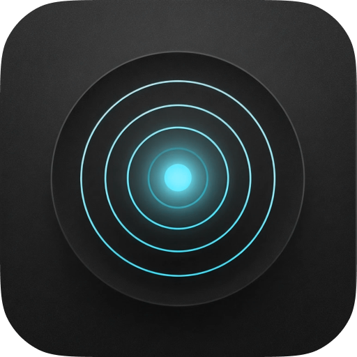

# Claude Dot



A tiny macOS menu bar dot that shows you what Claude Code is doing in real-time — so you don't have to keep checking the terminal.


## Features

- **Progress Visualization** — The menu bar dot changes color in real-time, so you don't have to stare at the terminal.
- **Proactive Alerts** — Sound notifications when Claude needs your input or finishes a task.
- **Quick Switch** — Left-click the dot to jump straight to your terminal window.
- **Zero Configuration** — Auto-detects your setup, works out of the box. Supports Ghostty, iTerm2, Warp, and Terminal.app.
- **Multilingual** — 8 languages supported, automatically matches your system language.

## What It Does

A colored dot lives in your menu bar and changes based on Claude Code's current state:

| Dot | Status | Meaning |
|-----|--------|---------|
|  | Disconnected | Claude Code is not running |
|  | Idle | Waiting for your input |
|  | Thinking | Processing your request |
|  | Responding | Writing a response |
|  | Tool Active | Running a tool (shell, file edit, etc.) |
|  | Needs Attention | Waiting for your permission |

Each state has a distinct animation and optional sound alert — you'll hear a chime when Claude needs your attention, and a pop when a task finishes.

## Install

### Download (Recommended)

1. Go to [Releases](../../releases) and download the latest `.dmg`
2. Open the DMG and drag **ClaudeDot** to Applications
3. Launch ClaudeDot from Applications

> **First launch note:** macOS will block unsigned apps downloaded from the internet. After dragging ClaudeDot to Applications, open Terminal and run:
>
> ```bash
> xattr -cr /Applications/ClaudeDot.app
> ```
>
> Then launch ClaudeDot normally. You only need to do this once.

### Build from Source

```bash
git clone https://github.com/poorfish/ClaudeDot.git
cd ClaudeDot
open ClaudeDot/ClaudeDot.xcodeproj
# Press Cmd+R to build and run
```

Requires Xcode 15+ and macOS 13 (Ventura) or later.

## Usage

- **Left-click** the dot — switches to your Claude Code terminal window
- **Right-click** the dot — opens a panel showing status details, sound toggle, and settings

Supports **Ghostty**, **iTerm2**, **Warp**, and **Terminal.app**.

## First Launch

ClaudeDot automatically configures itself on first launch by adding two hooks to `~/.claude/settings.json`:

- **statusLine** — polls Claude Code's idle state every 3 seconds
- **Notification hook** — detects when Claude needs your permission

No manual configuration needed. Just launch and go.

## Requirements

- macOS 13 (Ventura) or later
- [Claude Code](https://docs.anthropic.com/en/docs/claude-code) CLI installed

## License

MIT
